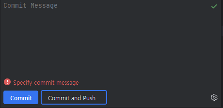
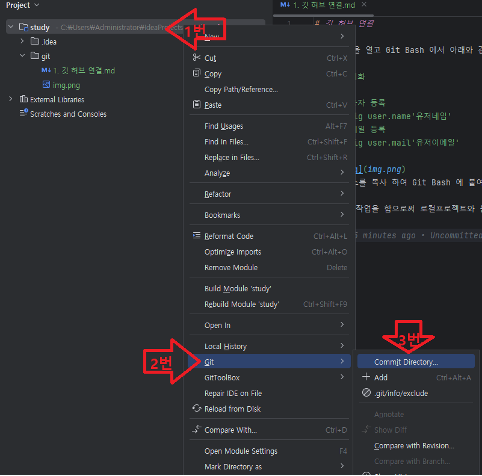
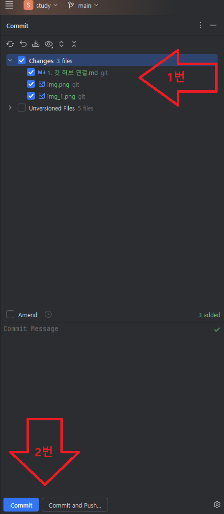

# 깃 허브 연결

1. '터미널' 을 열고 Git Bash 에서 아래와 같이 입력
```
// 깃 초기화
git init
// 깃 사용자 등록    
git config user.name'유저네임'
// 깃 이메일 등록 
git config user.mail'유저이메일'
```

체크된 박스를 복사 하여 Git Bash 에 붙여넣기 한다.

위와 같은 작업을 함으로써 로컬프로젝트와 원격저장소가 연결이 된다.



순서대로 누르게 되면



이와 같은 화면이 나오게 된다.

1번 화살표에서 업로드 하고 싶은 파일을 선택 후

커밋 메세지를 입력후

2번 화살표에서 Coommit and Push를 누르게 되면 종료된다